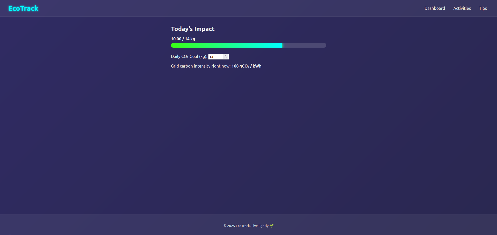
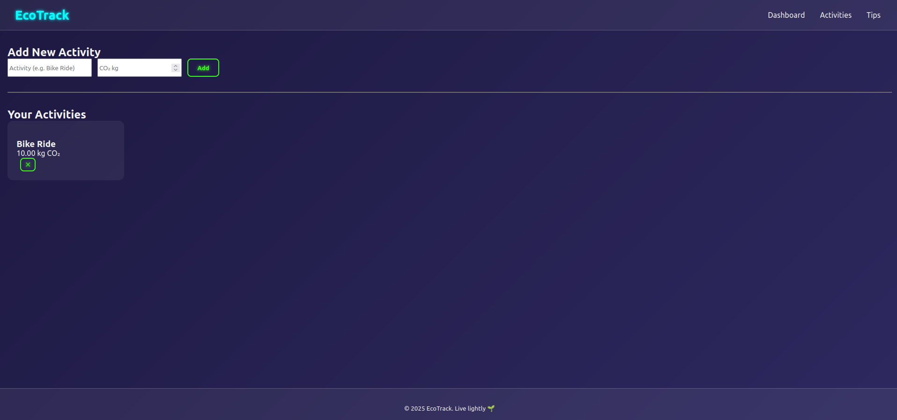
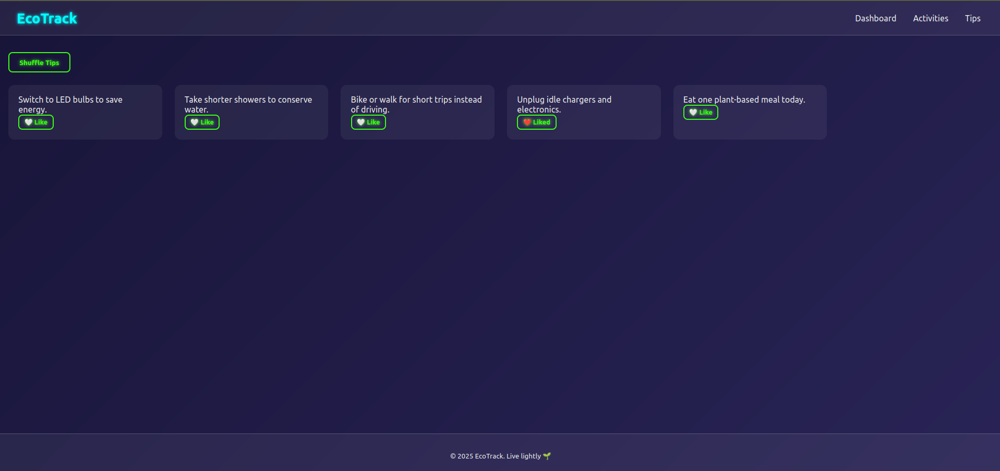

# EcoTrack – Phase 2

## What’s new in Phase 2
| Category | Enhancements |
|----------|--------------|
| **Styling** | Full‑screen animated gradient background, glassmorphic cards with neon glow, responsive flex/grid layout |
| **Animations** | Fade‑in & slide‑up page transitions, neon‑pulse hover on cards & buttons, smooth progress bar fill |
| **Features** | • Daily CO₂ goal & animated progress bar<br>• Delete activities<br>• Random “Tip of the Day”<br>• Dynamic route `/activities/[id]`<br>•Added API to get Grid carbon intensity right now |

## Getting Started


---

## File / Folder Structure (inside **src/**)
```
components/
  Layout.js
  Navbar.js
  Footer.js
  ActivityForm.js
  ActivityList.js
  ActivityCard.js
  GoalBar.js          // NEW
  TipCard.js
pages/
  _app.js
  index.js            // Dashboard
  activities.js
  activities/[id].js  // Dynamic details
  tips.js
styles/
  global.css
  Navbar.module.css
  Footer.module.css
  Card.module.css
  Progress.module.css // NEW
```


---

## Screenshots Phase 2

### Main page (Dashboard):


### Activities page:


### Tips page:



