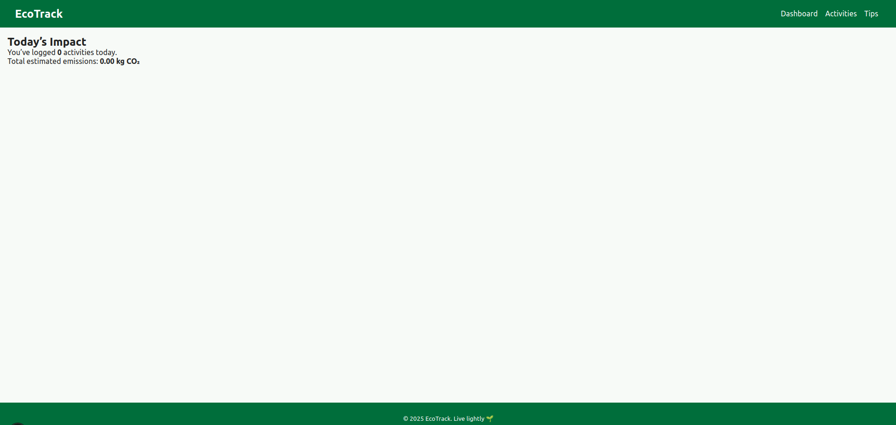
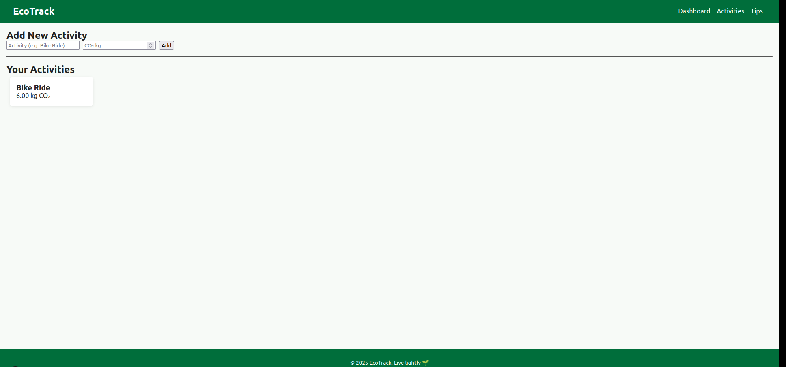
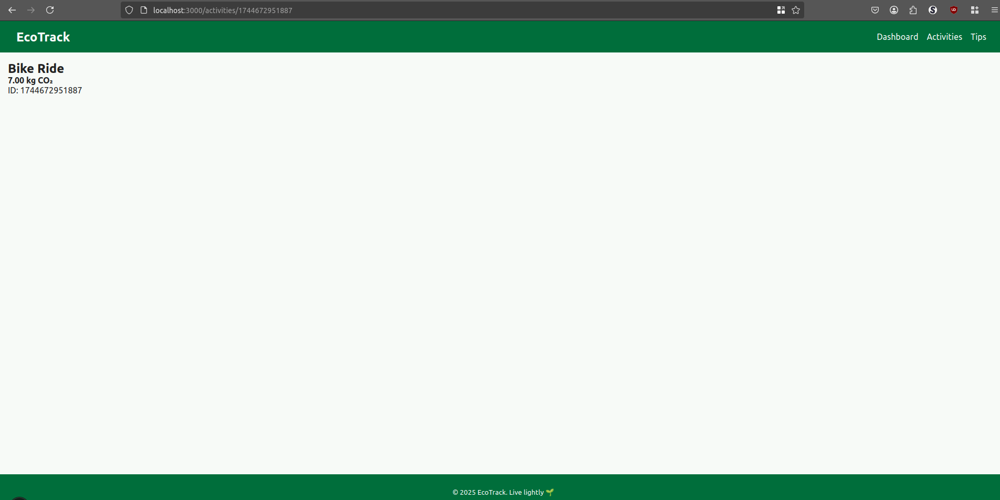
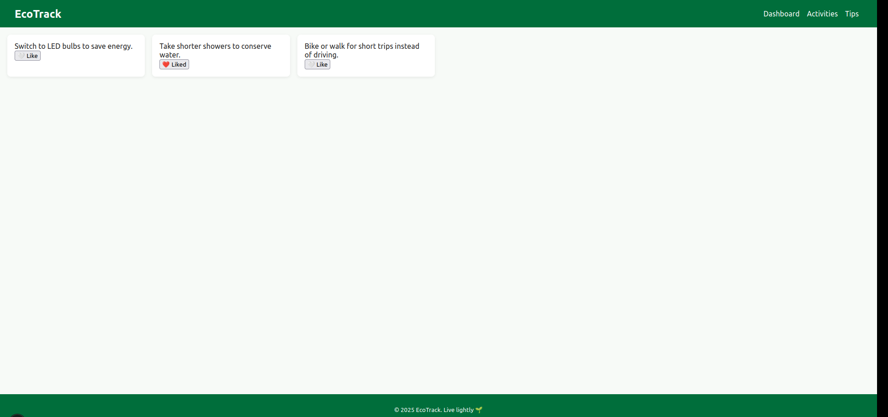

# EcoTrack – Personal Sustainability Dashboard

EcoTrack helps users track day‑to‑day activities that influence their carbon footprint and discover actionable tips to live more sustainably.

## Phase 1 Scope
* **Routing:** `/` (Dashboard), `/activities` (Activity Log), `/tips` (Sustainability Tips)
* **Core components:** `Navbar`, `Footer`, `Layout`, `ActivityForm`, `ActivityList`, `ActivityCard`, `TipCard`
* **State:** Activities are held in the `Activities` page and lifted to `Layout` so the Dashboard can summarise totals.
* **Styling:** Pure CSS Modules (`*.module.css`) + `global.css`, responsive with flexbox + media queries.

## Getting Started


---

## File / Folder Structure (inside **src/**)
```
components/
  Layout.js
  Navbar.js
  Footer.js
  ActivityForm.js
  ActivityList.js
  ActivityCard.js
  TipCard.js
pages/
  _app.js
  index.js
  activities.js
  activities/[id].js   // Phase 2 dynamic route
  tips.js
styles/
  global.css
  Navbar.module.css
  Footer.module.css
  Card.module.css
```
---

## Screenshots - Phase 1:

### Dashboard:


### Activities page:


### Exact Activity:


### Tips page:
