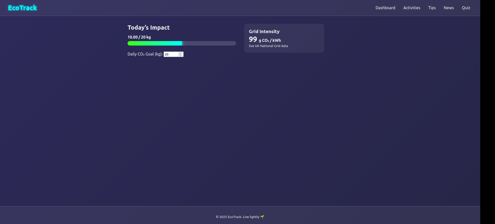
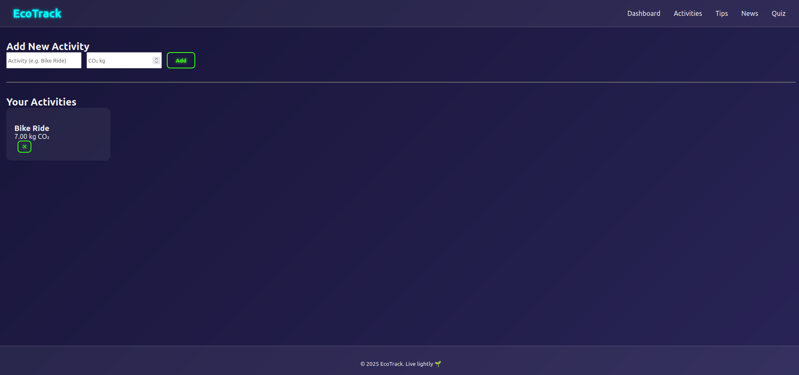
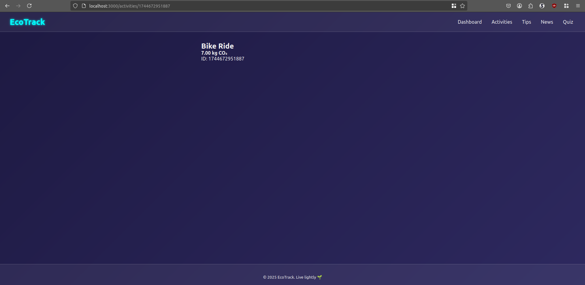
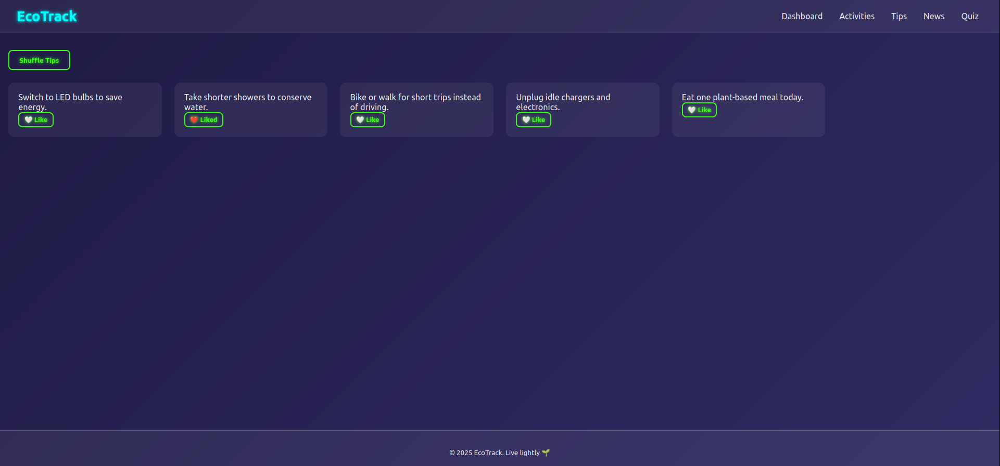
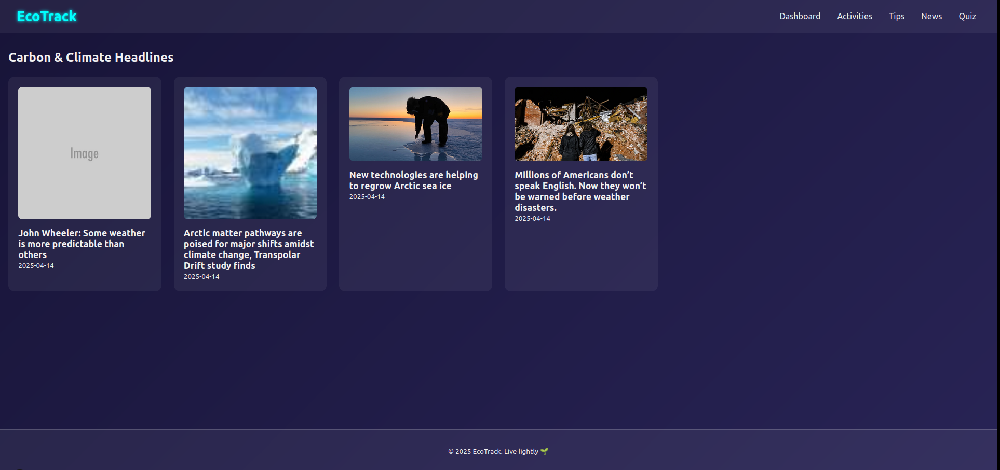
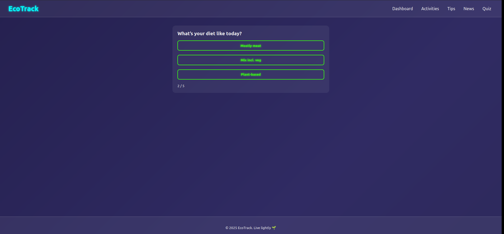

# 🌱 EcoTrack  
*A neon‑styled sustainability dashboard built with Next .js 13 (JavaScript only)*  

---

## Contributers
- **Timofei Semenov** – Phase 1/3 *(developerC)*  
- **April Jecylene Paz** – Phase 2 *(developerB)*  
- **Mark Kim** – Phase 1 *(developerA)*  

---

## 📚 Table of Contents
1. [Project Pitch](#project-pitch)  
2. [Branches & Team Workflow](#branches--team-workflow)  
3. [Getting Started](#getting-started)  
4. [Environment Variables](#environment-variables)  
5. [File‑Tree & Component Guide](#file-tree--component-guide)  
6. [Key Features](#key-features)  
7. [Tech Stack & Libraries](#tech-stack--libraries)  
8. [Credits](#credits)  
9. [Screenshots](#screenshots)

---

## Project Pitch
**EcoTrack** helps people **log daily activities**, **visualise their carbon impact**, and **discover quick eco‑wins**.  
The app balances *fun* (neon glassmorphism, fluid animations) with *utility* (progress bars, live news, quizzes) so users can **see, learn, and improve** in one place.

---

## Branches & Team Workflow
| Branch | Phase | Owner | Status |
|--------|-------|-------|--------|
| `main` | Production / latest stable | ✨ team‑merge | **active** |
| `developerA` | Phase 1 – project skeleton, core routing & state | Mark Kim | **complete** |
| `developerB` | Phase 2 – neon redesign, framer‑motion, new pages | April Jecylene Paz | **complete** |
| `developerC` | Phase 3 – API hooks, persistence, quiz module | Timofei Semenov | **complete** |

> **Tip:** Checkout any branch to see the code for that phase in isolation.

---

## Getting Started
```bash
# 1. Clone
git clone https://github.com/XRay876/GroupProject_CPAN-144-0NE/
cd group-project-cpan-144

# 2. Choose a branch 
git switch main            # or developerA / developerB / developerC

# 3. Install deps 
npm install              

# 4. Configure env vars
cp .env.local.example .env.local
#  └── add your NEWS_API_KEY (see below)

# 5. Dev server
npm run dev                   # open http://localhost:3000

# 6. Production build
npm build && npm start
```

---

## Environment Variables
| Key | Purpose | Where to get it |
|-----|---------|-----------------|
| `NEWS_API_KEY` | Pulls climate‑related headlines for the **/news** page. | Sign up free at **[newsdata.io](https://newsdata.io/)** → *Dashboard* → *API Keys* |

> Store secrets only in `.env.local` (git‑ignored).

---

## File‑Tree & Component Guide
```
group-project-cpan-144
│
├── screenshots/            # Phase screenshots for grading
└── src/
    ├── components/
    │   ├── ActivityCard.js     # glassy card summarising one activity
    │   ├── ActivityForm.js     # neon form (add / edit activities)
    │   ├── ActivityList.js     # grid wrapper + empty‑state logic
    │   ├── CarbonWidget.js     # calculates kg CO₂ for an activity
    │   ├── Footer.js           # social links + dark neon glow
    │   ├── GoalBar.js          # animated progress bar toward daily goal
    │   ├── Layout.js           # page shell (Navbar + Footer)
    │   ├── Navbar.js           # sticky nav with slide‑in links
    │   ├── NewsCard.js         # headline, source badge, fade‑in effect
    │   └── TipCard.js          # “Tip of the Day” flip‑card
    │
    ├── pages/
    │   ├── activities/
    │   │   └── [id].js         # dynamic route → detail & delete button
    │   ├── api/
    │   │   ├── carbon.js       # (mock) GET carbon factors
    │   │   └── news.js         # proxy to News API – hides key
    │   ├── _app.js             # global providers & framer‑motion wrapper
    │   ├── _document.js        # custom font preloads + meta tags
    │   ├── activities.js       # list + add new activity
    │   ├── index.js            # dashboard (goal bar + recent list)
    │   ├── news.js             # live climate news feed
    │   ├── quiz.js             # sustainability trivia (Phase 3)
    │   └── tips.js             # infinite scroll of eco‑tips
    │
    └── styles/
        ├── Card.module.css     # glassmorphism + hover pulse
        ├── Footer.module.css
        ├── globals.css         # neon gradient bg, fonts, resets
        ├── Navbar.module.css
        └── Progress.module.css # goal bar animation keyframes
```

---

## Key Features
### Core
- **Activity Logger** – add, edit, or delete actions (bike commute, meat‑free meal, etc.).
- **Carbon Calculator** – auto‑estimates kg CO₂ using factor table.
- **Daily Goal** – animated `GoalBar` fills toward user‑set target with colour‑shift at 100 %.
- **Tip of the Day** – flip‑card delivers a random eco‑hack; click *Shuffle* for more.
- **Live Climate News** – `/news` pulls headlines via NewsData API; lazy‑loads cards.

### UX & Polish
- **Neon Glass UI** – translucent cards on a moving gradient background.
- **Framer‑Motion** – page transitions slide & fade; cards pop on hover.
- **Responsive Grid** – CSS clamp() & fluid type for mobile → desktop.
- **Local Persistence** – activities and goal stored in `localStorage`.

### Extras (Phase 3)
- **Sustainability Quiz** – 5‑question trivia with score tracker.
- **Accessibility Pass** – prefers‑reduced‑motion respect; 3:1 colour contrast.
- **Offline Fallback** – PWA manifest & basic service‑worker cache (experimental).

---

## Tech Stack & Libraries
- **Next.js 13** (Pages Router, no TypeScript)  
- **React 18**  
- **Framer Motion** – animations & route transitions  
- **CSS Modules** – scoped styles, no Tailwind  
- **classnames** – conditional class helper  
- **uuid** – activity IDs  
- **NewsData.io REST API** – climate headlines  

---


## Credits 
- **Timofei Semenov** – Phase 1/3 *(developerC)*  
- **April Jecylene Paz** – Phase 2 *(developerB)*  
- **Mark Kim** – Phase 1 *(developerA)*  


---

## Screenshots

### Home page (Dashboard):


### Activities page:


### Exact Activity page:


### Tips page:


### News page:


### Quiz page:

