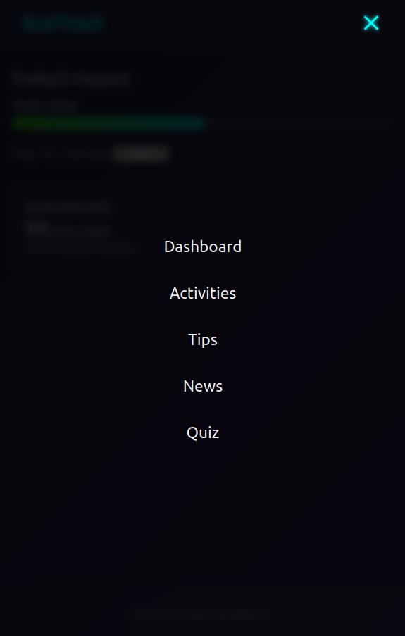

# EcoTrack · Phase 3

## ✨ New Features
| Area | What changed |
|------|--------------|
| **Dashboard** | Carbon‑intensity moved into its own neon card; responsive grid layout |
| **News** | `/news` route + `NewsCard` components. Serverless route `/api/news` fetches live environment headlines via NewsData.io |
| **Quiz** | `/quiz` route implements a 5‑question eco‑lifestyle quiz with animated score reveal |
| **Mobile UX** | Hamburger menu toggles full‑screen overlay nav on ≤720 px |
| **Styling** | Minor CSS tweaks, card image styles, smoother fade‑in animations |

## Screenshots Phase 3

### News page:

### Changed API Carbon Widget:

### Quiz page:

### Navigation menu for phone:

